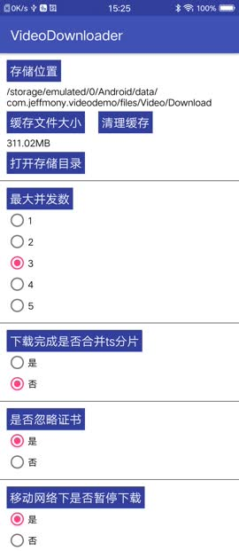

# VideoDownloader
#### 视频下载SDK功能
> * 下载整视频，如mp4/mkv/mov/3gp等视频
> * 下载HLS，即M3U8视频
> * M3U8 视频下载完成，会生成一个本地的local.m3u8文件
> * 视频下载完成，可以点击播放视频文件
> * 视频下载数据库记录视频下载信息
> * 增加视频下载队列
> * 增加M3U8合并为MP4的功能

#### 版本更新
##### 4.1.0
> * M3U8文件下载完成后合并为MP4文件
> * 优化部分HTTPS链接下载失败的问题
##### 3.0.0
> * 解决部分M3U8视频下载失败的问题
> * 更新playersdk版本
> * 优化fileName和filePath问题

```
allprojects {
    repositories {
	    maven { url 'https://jitpack.io' }
	}
}

dependencies {
    implementation 'com.github.JeffMony:VideoDownloader:4.1.0'
}
```

#### 视频下载SDK接入<br>
##### 1.应用启动的时候注册download config
```
File file = VideoDownloadUtils.getVideoCacheDir(this);
if (!file.exists()) {
    file.mkdir();
}
VideoDownloadConfig config = new VideoDownloadManager.Build(this)
    .setCacheRoot(file)
    .setUrlRedirect(true)
    .setTimeOut(DownloadConstants.READ_TIMEOUT, DownloadConstants.CONN_TIMEOUT)
    .setConcurrentCount(DownloadConstants.CONCURRENT)
    .setIgnoreCertErrors(true)
    .setShouldM3U8Merged(true)
    .buildConfig();
VideoDownloadManager.getInstance().initConfig(config);
```
##### 2.注册download listener回调，这个回调只要注册一次就行了，是全局回调
```
VideoDownloadManager.getInstance().setGlobalDownloadListener(mListener);

private DownloadListener mListener = new DownloadListener() {

    @Override
    public void onDownloadDefault(VideoTaskItem item) {}

    @Override
    public void onDownloadPending(VideoTaskItem item) {}

    @Override
    public void onDownloadPrepare(VideoTaskItem item) {}

    @Override
    public void onDownloadStart(VideoTaskItem item) {}

    @Override
    public void onDownloadProgress(VideoTaskItem item) {}

    @Override
    public void onDownloadSpeed(VideoTaskItem item) {}

    @Override
    public void onDownloadPause(VideoTaskItem item) {}

    @Override
    public void onDownloadError(VideoTaskItem item) {}

    @Override
    public void onDownloadSuccess(VideoTaskItem item) {}
};
```
VideoTaskItem中信息介绍
```
public class VideoTaskItem implements Cloneable {

    private String mUrl;                 //下载视频的url
    private long mDownloadCreateTime;    //下载创建的时间
    private int mTaskState;              //当前任务的状态
    private String mMimeType;            // 视频url的mime type
    private String mFinalUrl;            //30x跳转之后的url
    private int mErrorCode;              //当前任务下载错误码
    private int mVideoType;              //当前文件类型
    private M3U8 mM3U8;                  //M3U8结构,如果非M3U8,则为null
    private int mTotalTs;                //当前M3U8的总分片
    private int mCurTs;                  //当前M3U8已缓存的分片
    private float mSpeed;                //当前下载速度, getSpeedString 函数可以将速度格式化
    private float mPercent;              //当前下载百分比, 0 ~ 100,是浮点数
    private long mDownloadSize;          //已下载大小, getDownloadSizeString 函数可以将大小格式化
    private long mTotalSize;             //文件总大小, M3U8文件无法准确获知
    private String mFileHash;            //文件名的md5
    private String mSaveDir;             //保存视频文件的文件目录名
    private boolean mIsCompleted;        //是否下载完成
    private boolean mIsInDatabase;       //是否存到数据库中
    private long mLastUpdateTime;        //上一次更新数据库的时间
    private String mFileName;            //文件名
    private String mFilePath;            //文件完整路径(包括文件名)
    private boolean mPaused;

}
```

VideoTaskState下载状态信息介绍
```
public class VideoTaskState {
    public static final int DEFAULT = 0;//默认状态
    public static final int PENDING = -1;//下载排队
    public static final int PREPARE = 1;//下载准备中
    public static final int START = 2;  //开始下载
    public static final int DOWNLOADING = 3;//下载中
    public static final int PROXYREADY = 4; //视频可以边下边播
    public static final int SUCCESS = 5;//下载完成
    public static final int ERROR = 6;//下载出错
    public static final int PAUSE = 7;//下载暂停
    public static final int ENOSPC = 8;//空间不足
}
```
##### 3.获取当前的下载任务
```
VideoDownloadManager.getInstance().fetchDownloadItems(IDownloadInfosCallback callback)

public interface IDownloadInfosCallback {
    void onDownloadInfos(List<VideoTaskItem> items);
}
```
接口返回的List<VideoTaskItem>就是当前正在下载的任务

##### 4.启动下载
```
VideoDownloadManager.getInstance().startDownload(item);
```
##### 5.暂停下载
```
VideoDownloadManager.getInstance().pauseDownloadTask(item.getUrl());
```
##### 6.恢复下载
```
VideoDownloadManager.getInstance().pauseDownloadTask(item.getUrl());
```
##### 7.删除下载任务
```
VideoDownloadManager.getInstance().deleteVideoTask(String videoUrl, boolean shouldDeleteSourceFile)
```
##### 8.全部暂停
```
VideoDownloadManager.getInstance().pauseDownloadTask(List<String> urlList)
```

##### 功能示意


欢迎关注我的公众号JeffMony，我会持续为你带来音视频---算法---Android---python 方面的知识分享<br>
